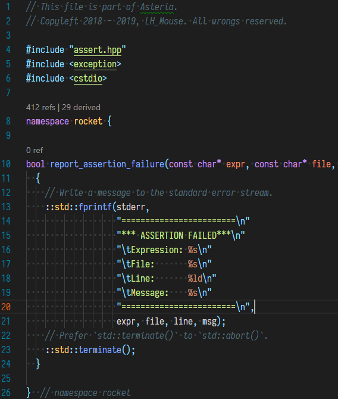
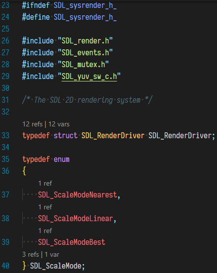
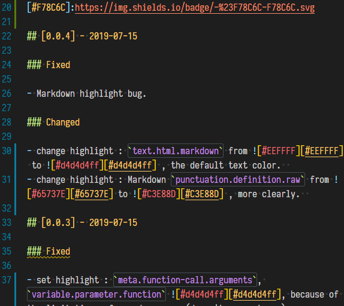
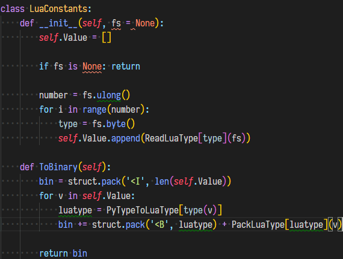
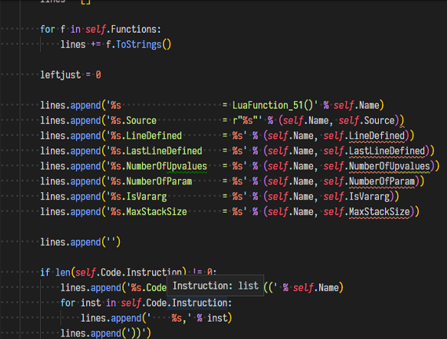

# Syntax Highlight Theme

[![marketplace-image]][marketplace-url] [![appveyor-image]][appveyor-url] [![GitHub-image]][GitHub-url] [![license-image]][license-url] [![Codacy Badge image]][Codacy Badge url]

[marketplace-image]:https://img.shields.io/vscode-marketplace/v/peaceshi.syntax-highlight.svg?style=flat&logo=visual-studio-code&label=marketplace&color=007ACC
[marketplace-url]:https://marketplace.visualstudio.com/items?itemName=peaceshi.syntax-highlight
[appveyor-image]:https://img.shields.io/appveyor/ci/peaceshi/syntax-highlight-theme.svg?style=flat&logo=appveyor&label=master
[appveyor-url]:https://ci.appveyor.com/project/peaceshi/syntax-highlight-theme/
[GitHub-image]:https://img.shields.io/badge/GitHub-issues-red.svg
[GitHub-url]:https://github.com/peaceshi/Syntax-highlight-Theme/issues
[license-image]:https://img.shields.io/github/license/peaceshi/Syntax-highlight-Theme.svg
[license-url]:https://github.com/peaceshi/Syntax-highlight-Theme/blob/master/LICENSE
[Codacy Badge image]:https://api.codacy.com/project/badge/Grade/62132740f27e405eb54e0ca6e2bf58f0
[Codacy Badge url]:https://www.codacy.com/manual/peaceshi/Syntax-Highlight-Theme?utm_source=github.com&amp;utm_medium=referral&amp;utm_content=peaceshi/Syntax-Highlight-Theme&amp;utm_campaign=Badge_Grad

[hard]:https://img.shields.io/badge/-Hard-red.svg
[normal]:https://img.shields.io/badge/-Normal-blue.svg
[easy]:https://img.shields.io/badge/-Easy-green.svg
[High]:https://img.shields.io/badge/-High--Priority-important.svg
[Medium]:https://img.shields.io/badge/-Medium--Priority-brightgreen.svg
[Low]:https://img.shields.io/badge/-Low--Priority-inactive.svg

## About Syntax Highlight Theme

**For some reason(such as italic and font weights needed), I recommends using** [Iosevka](https://github.com/be5invis/Iosevka) **or** [Sarasa-Gothic(for CJK)](https://github.com/be5invis/Sarasa-Gothic) **font with this theme.**  

**Now you can choose a beta test theme `Syntax Material Dark Level 1 (beta)`directly. It supports most languages that VSCode supports now.**  

If you do not like italic or weights, just disable it in your settings easily.

This is theme highlight supports, **not** parsers now.  

## Job schedules  

|     Level      |    1    |     2     |    3    |
| :------------: | :-----: | :-------: | :-----: |
| **Difficulty** | ![easy] | ![normal] | ![hard] |
|  **Priority**  | ![Low]  | ![Medium] | ![High] |

[Reshaper inlay hints]:https://www.jetbrains.com/help/resharper/Inline_Parameter_Name_Hints.html
[multiple selections]:https://code.visualstudio.com/docs/editor/codebasics#_multiple-selections-multicursor

- **TODO**
  - [ ] Modern code IntelliSense and editor enhancement.  
    - [ ] ![hard] ![High] [Reshaper inlay hints].
    - [ ] ![normal] ![Medium] Hover help in the editor for editor keyboard shortcuts and [multiple selections].  
  - [ ] ![normal] ![Low] Make a tool to change theme colors more easily.  
  - [ ] ![easy] ![Low] Design a new extension icon.
  - [ ] ![hard] ![Medium] Write documents for this responsory.
- **Working**
  - [x] ![normal] ![High] Add more language supports. **Beta test now!**.  
  - [ ] ![hard] ![Medium] Make sure behavioral consistency for supported languages.
- **Finished**
  - [x] The language scopes generate tool. See `/tools/`.
    - [x] ![easy] Make a general file to support most languages. See `/language_tags/`.

## Additional install  

[Better C++ Syntax]:https://marketplace.visualstudio.com/items?itemName=jeff-hykin.better-cpp-syntax
[lua-language-server]:https://marketplace.visualstudio.com/items?itemName=sumneko.lua
[Microsoft C/C++]:https://marketplace.visualstudio.com/items?itemName=ms-vscode.cpptools
[Enhanced colorization]:https://code.visualstudio.com/docs/cpp/colorization-cpp

- [Better C++ Syntax] for full **cpp** and its supports.  
- [lua-language-server] for more **lua** support.  
- (Optional,buggy now) [Microsoft C/C++] , then set `"C_Cpp.enhancedColorization": "Enabled",` and `IntelliSense enabled` to use [Enhanced colorization].  

Then use this theme, enjoy!  

## What's new

See [CHANGELOG](https://github.com/peaceshi/Syntax-highlight-Theme/blob/master/CHANGELOG.md)  

## Snapshot (New)

[Markdown]:https://github.com/peaceshi/Syntax-highlight-Theme/blob/master/Documents/markdown.md
[C++]:https://github.com/peaceshi/Syntax-highlight-Theme/blob/master/Documents/cpp.cpp
[Python]:https://github.com/peaceshi/Syntax-highlight-Theme/blob/master/Documents/python.py

|           [Markdown]            |
|  :---------------------------:  |
|  |
|              [C++]              |
|  |
|              [Python]           |
|  |

## Snapshot (Old)

|           **C++**            |                              |
| :--------------------------: | :--------------------------: |
|  |  |
|            **C**             |         **Markdown**         |
|  |  |
|          **Python**          |                              |
|  |  |
|           **Lua**            |
|  |
