# Root

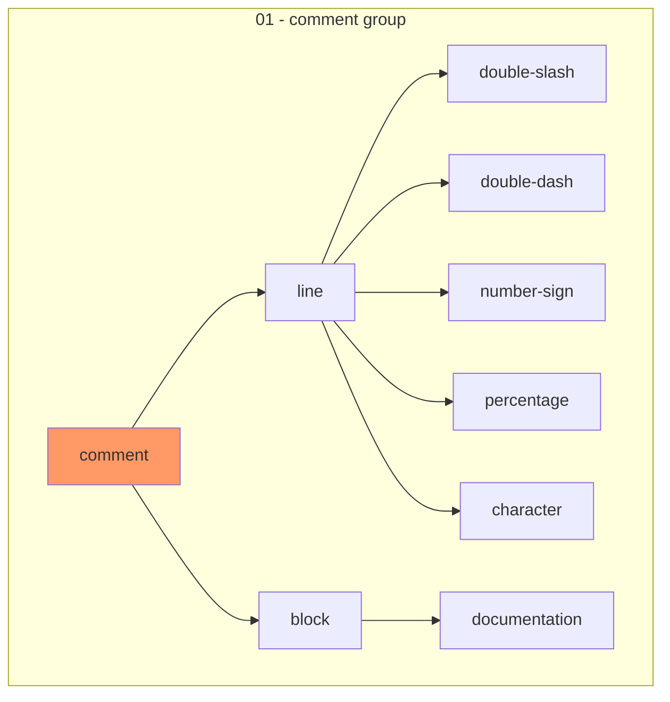
```mermaid
graph LR;
classDef root fill:#f96
subgraph 01 - comment group
    direction LR
    comment:::root
    comment-->line
        line-->double-slash
        line-->double-dash
        line-->number-sign
        line-->percentage
        line-->character
    comment-->block
        block-->documentation
end
```

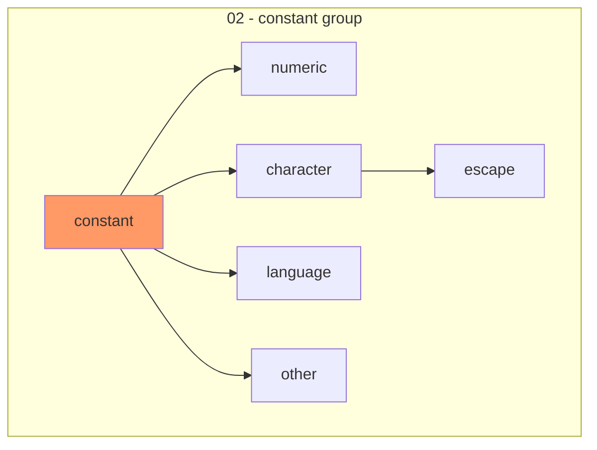
```mermaid
graph LR;
classDef root fill:#f96
subgraph 02 - constant group
    direction LR
    constant:::root
    constant-->numeric
    constant-->character
        character-->escape
    constant-->language
    constant-->other
end
```

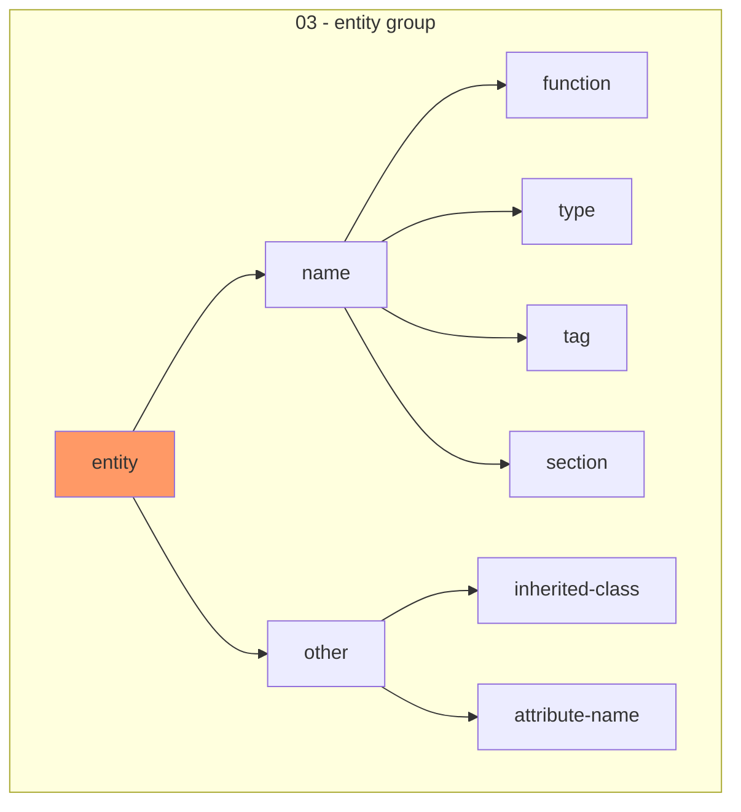
```mermaid
graph LR;
classDef root fill:#f96
subgraph 03 - entity group
    direction LR
    entity:::root
    entity-->name
        name-->function
        name-->type
        name-->tag
        name-->section
    entity-->other
        other-->inherited-class
        other-->attribute-name
end
```

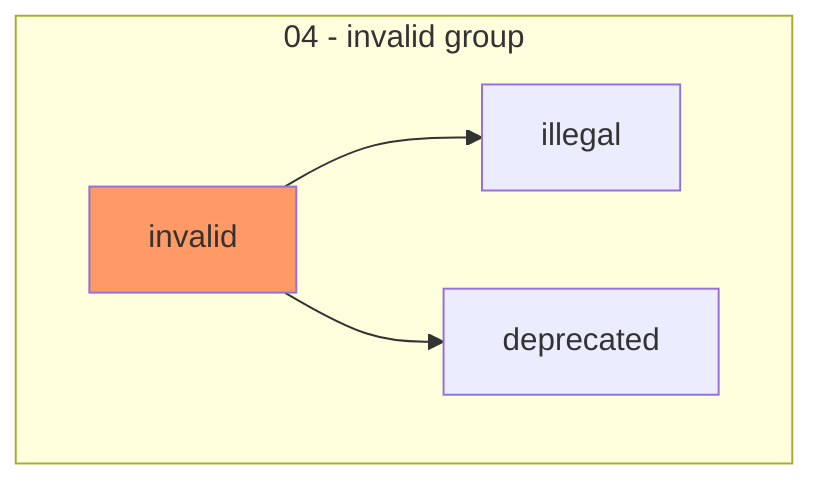
```mermaid
graph LR;
classDef root fill:#f96
subgraph 04 - invalid group
    direction LR
    invalid:::root
    invalid-->illegal
    invalid-->deprecated
end
```

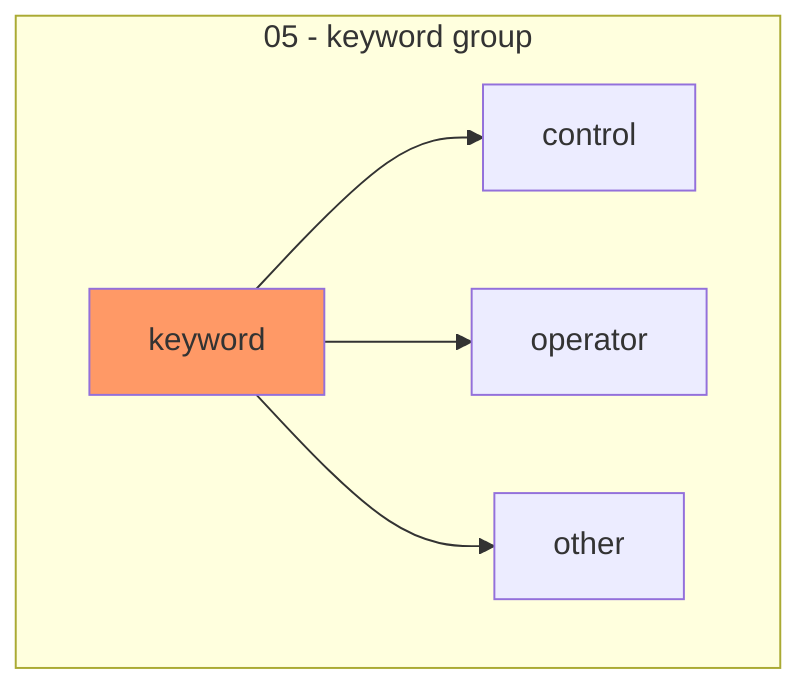
```mermaid
graph LR;
classDef root fill:#f96
subgraph 05 - keyword group
    direction LR
    keyword:::root
    keyword-->control
    keyword-->operator
    keyword-->other
end
```

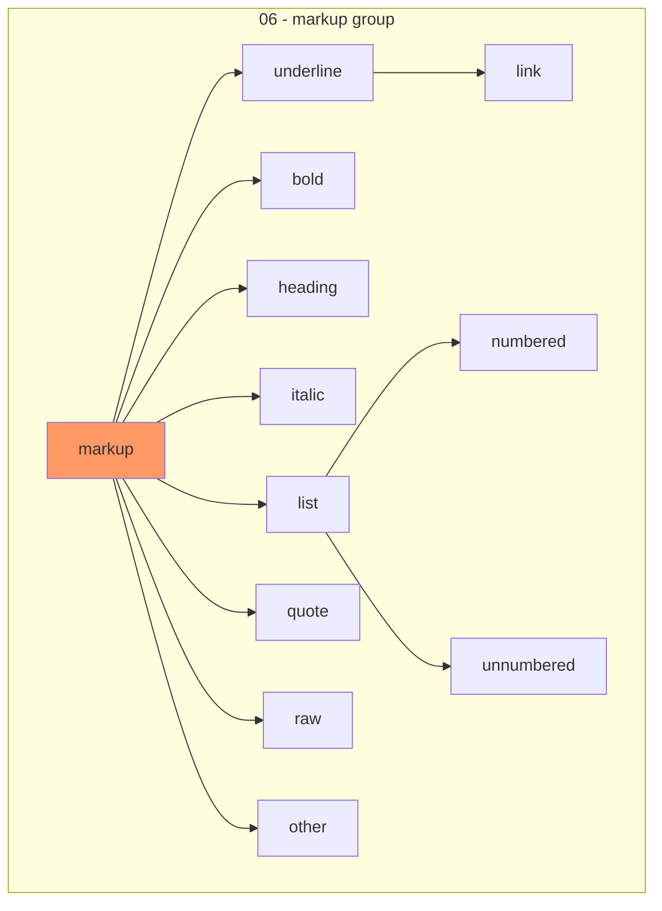
```mermaid
graph LR;
classDef root fill:#f96
subgraph 06 - markup group
    direction LR
    markup:::root
    markup-->underline
        underline-->link
    markup-->bold
    markup-->heading
    markup-->italic
    markup-->list
        list-->numbered
        list-->unnumbered
    markup-->quote
    markup-->raw
    markup-->other
end
```

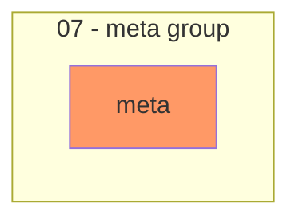
```mermaid
graph LR;
classDef root fill:#f96
subgraph 07 - meta group
    direction LR
    meta:::root
end
```

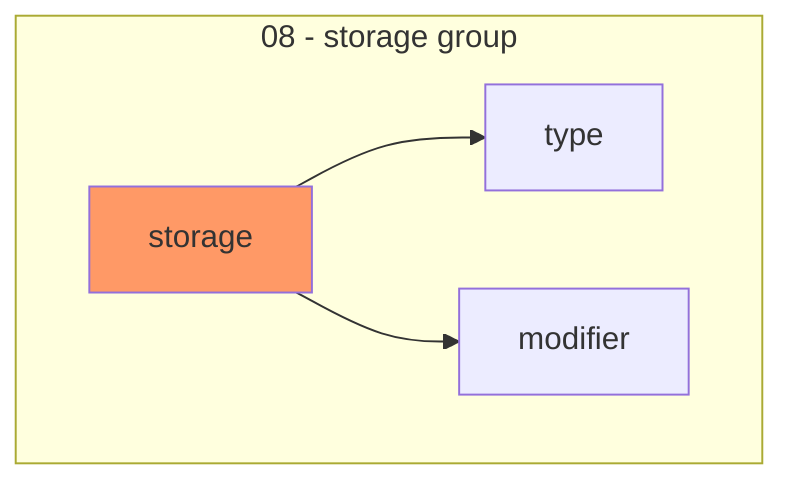
```mermaid
graph LR;
classDef root fill:#f96
subgraph 08 - storage group
    direction LR
    storage:::root
    storage-->type
    storage-->modifier
end
```

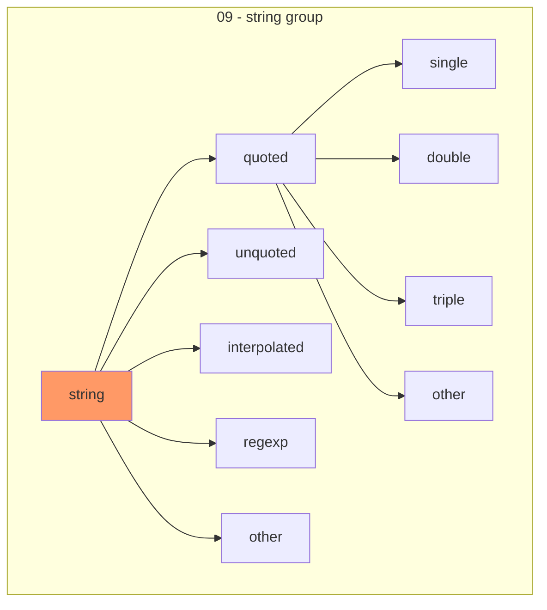
```mermaid
graph LR;
classDef root fill:#f96
subgraph 09 - string group
    direction LR
    string:::root
    string-->quoted
        quoted-->single
        quoted-->double
        quoted-->triple
        quoted-->other0[other]
    string-->unquoted
    string-->interpolated
    string-->regexp
    string-->other1[other]
end
```

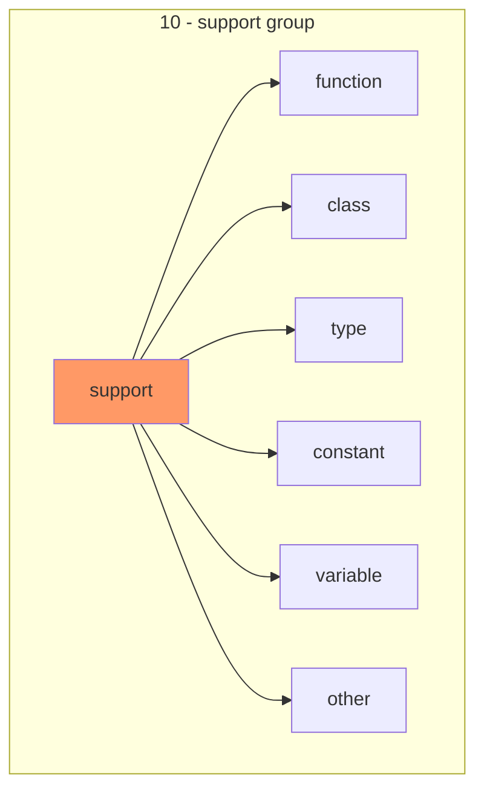
```mermaid
graph LR;
classDef root fill:#f96
subgraph 10 - support group
    direction LR
    support:::root
    support-->function
    support-->class0[class]
    support-->type
    support-->constant
    support-->variable
    support-->other
end
```

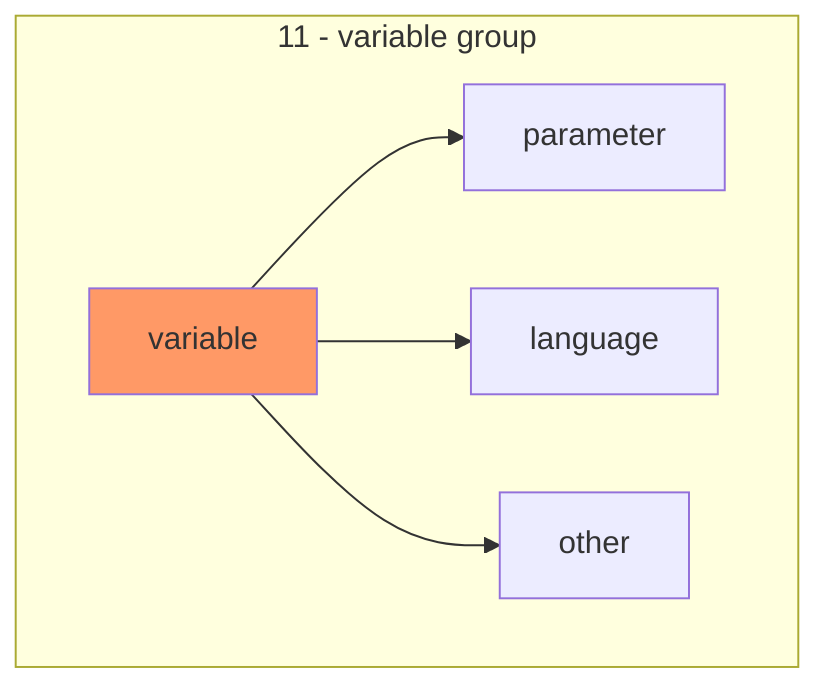
```mermaid
graph LR;
classDef root fill:#f96
subgraph 11 - variable group
    direction LR
    variable:::root
    variable-->parameter
    variable-->language
    variable-->other
end
```
